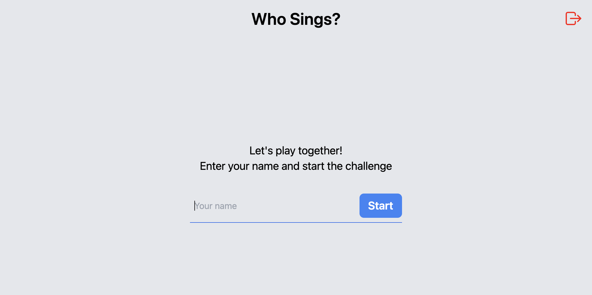
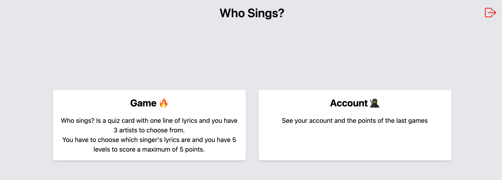
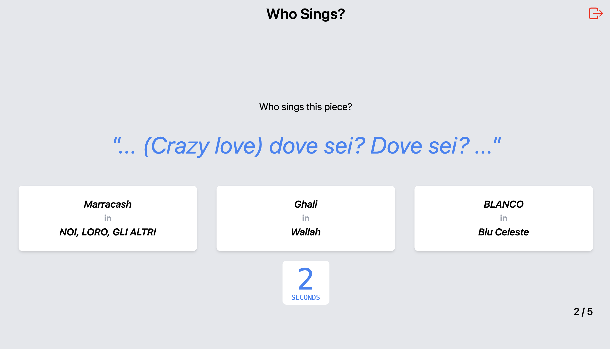
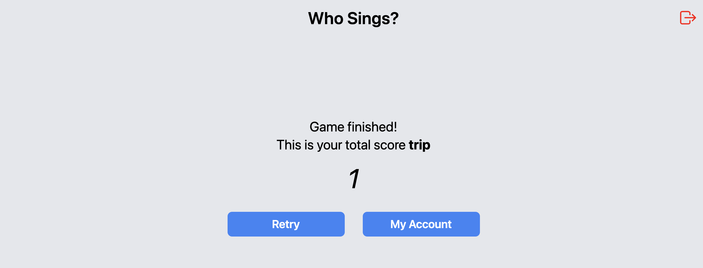
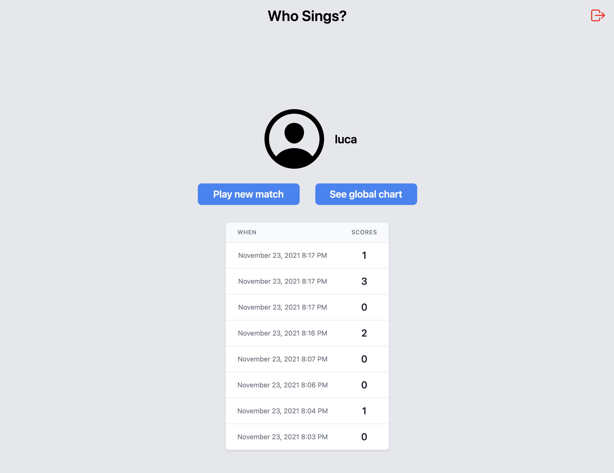
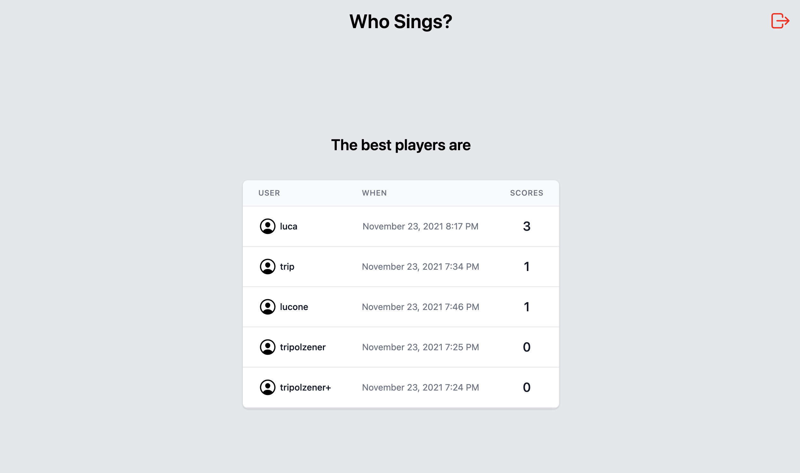

# Who sings?

This project is a quiz game where you have to guess which artist has sung a piece of song to test some MusixMatch APIs. You will have 5 rounds to try to get the best possible score, where in 5sec you have to guess which of the 3 singers shown sang that song. If the answer is right you will earn 1 point, otherwise you will earn 0 points. In addition, you will have a screen to view all the games of that user and a screen where you can view the best users who have played. The app is realized with these technologies:

    - React
    - Typescript
    - Tailwind CSS
    - localstorage

## Available Scripts

If you want to try this project, you have to download or clone this project. Once this is done, you have to run the following commands:

```bash
npm install
npm run start
```

You will need to get an `apikey` to be able to authenticate your calls, if you don't have one you need to create a developer account [here](https://developer.musixmatch.com/).
If you have already an `apikey`, or you can configure a `.env` file where you put your secret apikey, or you can replace `process.env.MM_APIKEY` variable in this file src/app/api/client.tsx.

## Some Screenshots

Screen where you can add a user or start with one already saved in the localstorage


Screen where you can select what to do


Screen where you can play


end-of-game screen


Account screen


Best players screen

